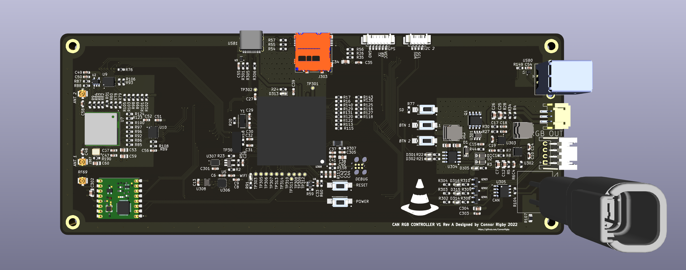
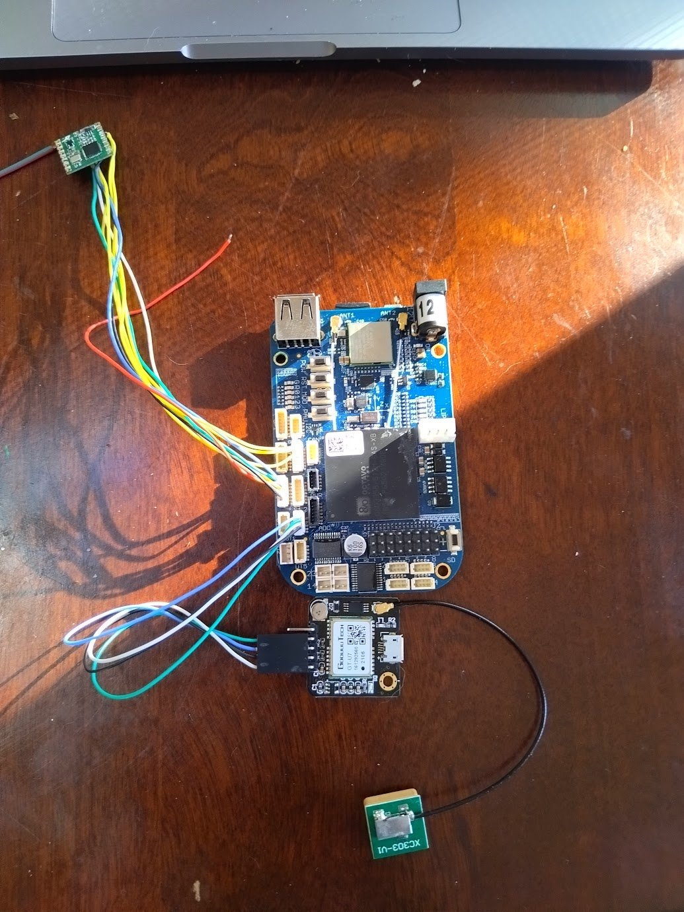

# Underglow Sync Device

Very much work in progress software and hardware project built with [Nerves](https://www.nerves-project.org/), [Flutter](https://flutter.dev/), [Kicad](https://www.kicad.org/), [Zig](https://ziglang.org/), [Lua](https://www.lua.org) and pretty much any other tech buzz word you might want. See [The requirements doc](Requirements.md) for the guts of the project.

## TLDR

Here's a [Twitter thread](https://twitter.com/pressy4pie/status/1504309482054029315) showing a demo of the ECU integration.
[video link](https://video.twimg.com/ext_tw_video/1504309386151301125/pu/vid/720x1280/zwIcUEVZBSSQAASE.mp4?tag=12).

Here's a render of the PCB
.

Here's a photo of the radio/gps module prototypes. .

Here's a photo of the entire prototype. 

Here's a [Twitter thread](https://twitter.com/pressy4pie/status/1506779115122139137) showing a demo of the GPS and companion application. [video link](https://video.twimg.com/ext_tw_video/1506778163891740673/pu/vid/720x1630/oxYdaMkSowD5uJmU.mp4?tag=12).

## Description

This README acts as a root for all the jillion projects contained within the repo. There is no inherit relationship between any folders. Some are Elixir, some are flutter, etc. One day clean it up. Too much proof of concepting going on right now.

| Folder Name | Description | Language | License |
| ------------| ----------- | -------- | ------- |
| [hardware](hardware/README.md) | Main hardware designs. Contains schematics, layouts, boms, manufacturing gerbers etc. | KiCad | Creative Commons |
| [firmware](firmware/README.md) | Main Nerves Firmware project. | Elixir | MIT |
| [socket_can](elixir-socket-can/README.md) | CAN interface library fork | Elixir | ??? |
| [canscript](canscript/README.md) | Main Lua environment and runtime. | Zig | MIT |
| [can_companion](can_companion/README.md) | proof of concept mobile app for interfacing GPS | Flutter | MIT |
| [elixir-GPSd](elixir-gpsd/README.md) | GPS library | Elixir | MIT |
| [deleteme](deleteme/README.md) | Test firmware for radio functions, to be deleted | Elixir | MIT |

There are auxilary projects involved in the development of this one. Notably:

* [nerves_system_bbb_can](https://github.com/connorrigby/nerves_system_bbb_can) - Nerves base system for this device. There are so many changes now, that it should be moved here.
* [elixir-rf69](https://github.com/connorrigby/elixir-rf69) - Elixir library for interfacing the RF69 Radio
