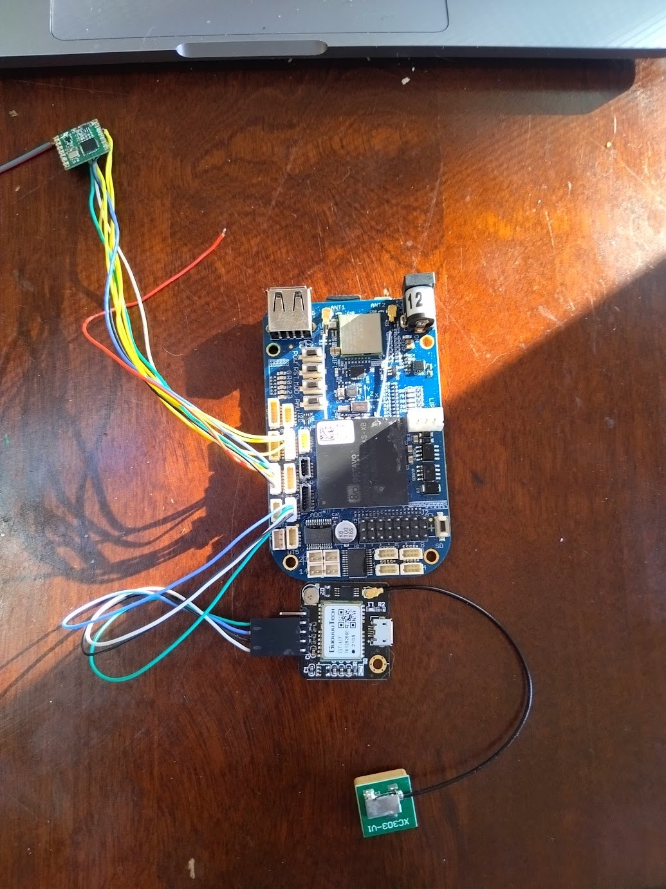
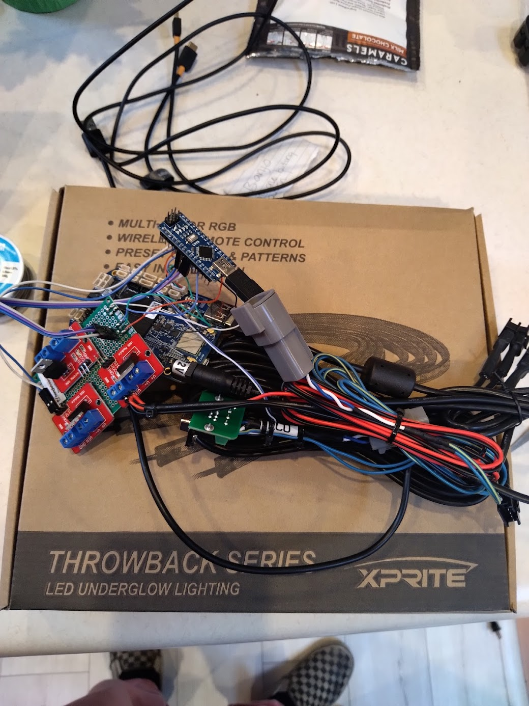
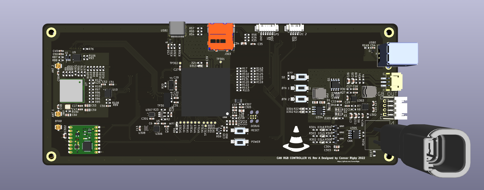
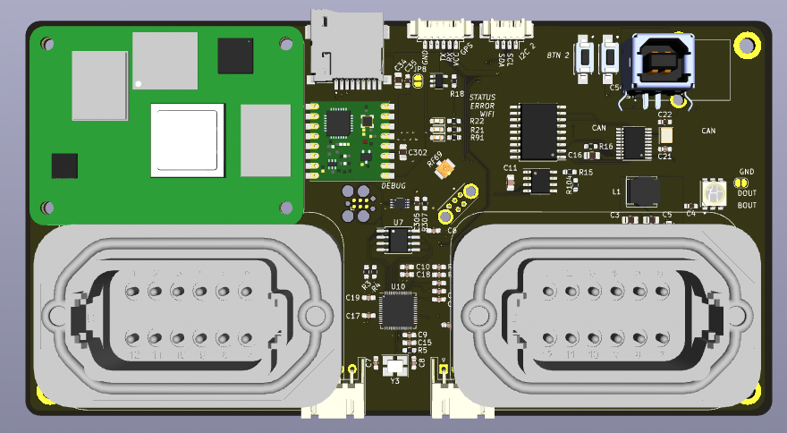
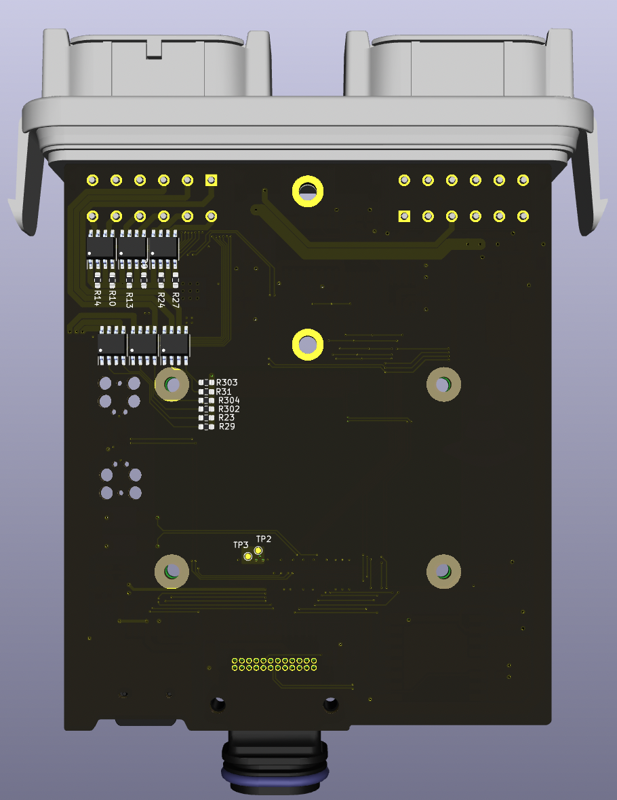
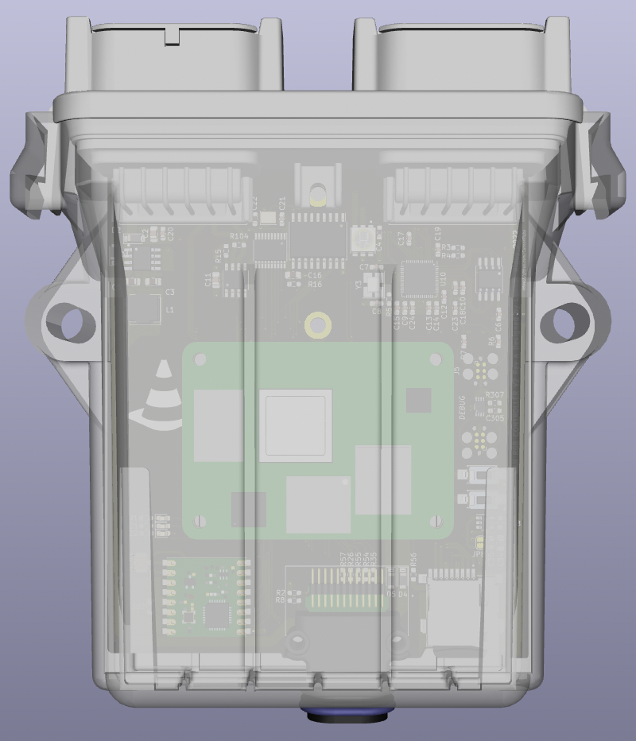
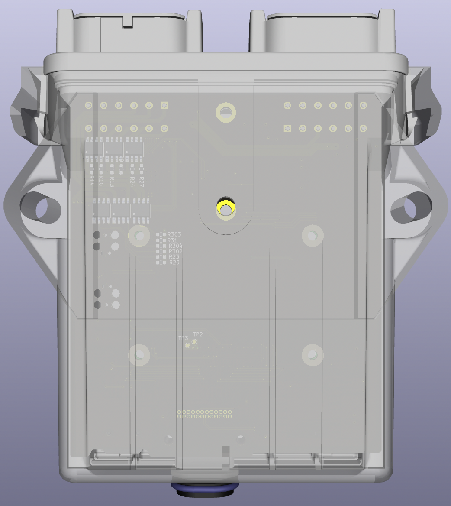

# Hardware Designfiles

## Prototypes

## Renders

### V1 (04/03/22)

Initial design. Could not source components, notably the main OSD335x CPU

### V2 (04/10/22)

Redesign using CM4 module with supporting chips for extra features

### V2 Rev A (04/12/22)

Revision of the intial V2 design to support a TE connectivity case/connector

## Features and Core Components

|name                |function                       |
|--------------------|-------------------------------|
|CM4 Module          |Main CPU                       |
|RP2040              |GPIO expander                  |
|MCP2515             |CAN Interface                  |
|RFM69 Packet Radio  |Sub GHz radio for local syncing|
|12 Low side drivers |PWM capable for driving LEDs   |
|4 TTL level outputs |Individually addressable LEDs  |
